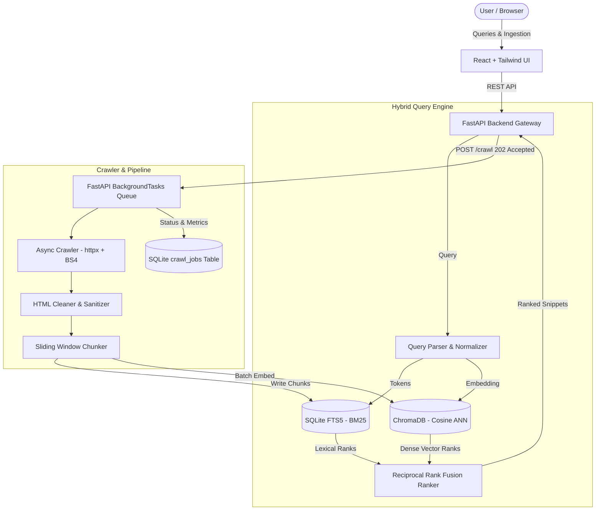

# ⚡ Reddy-dev Search Engine

A production-ready, modular hybrid search engine application built from scratch with a high-performance Python backend and a modern React web interface.

Combines **BM25 lexical search (SQLite FTS5)** with **dense semantic vector retrieval (`all-MiniLM-L6-v2` via ChromaDB)** using **Reciprocal Rank Fusion (RRF)**, backed by an **asynchronous web crawler & document ingestion pipeline**.

-38bdf8?style=for-the-badge)


---

## 🌟 Key Features

- 🔍 **Hybrid Retrieval Engine**: Runs concurrent BM25 (SQLite FTS5) and dense vector similarity search, merging top candidates using **Reciprocal Rank Fusion (RRF, $k=60$)**.
- 🧠 **Lightweight Semantic Embeddings**: Uses Hugging Face `sentence-transformers/all-MiniLM-L6-v2` optimized for CPU inference (< 512MB RAM cloud friendly, batch limit = 16).
- 🕷️ **Asynchronous Web Crawler**: `httpx` + `BeautifulSoup4` with `robots.txt` parsing, domain rate limiting, exponential backoff retries, and clean document extraction.
- ⚡ **Background Job Queue**: `POST /crawl` enqueues ingestion jobs via FastAPI `BackgroundTasks`, returning `202 Accepted` with a UUID `job_id` and SQLite persistent job tracking.
- 📑 **Granular Chunking**: 500-word sliding window chunker with 50-word overlap for high-precision snippet retrieval.
- 🎨 **Modern Dark UI**: React + Tailwind CSS with debounced auto-suggest, snippet highlight badges (`<mark>`), latency counter (e.g. *Found 24 results in 40ms*), and real-time crawling status modals.
- ☁️ **Cloud-Native & Containerized**: Multi-stage `Dockerfile` with model pre-downloading, `VOLUME ["/app/data"]` for persistent volume mounts, and dynamic CORS.

---

## 🏗️ System Architecture



---

## 📁 Repository Structure

```
.
├── backend/
│   ├── app/
│   │   ├── api/                  # REST endpoints (/search, /crawl, /stats)
│   │   ├── crawler/              # Async crawler, HTML cleaner & document models
│   │   ├── indexer/              # SQLite FTS5 index, ChromaDB vector store, chunker
│   │   ├── engine/               # Query parser, Hybrid RRF ranker, latency coordinator
│   │   ├── config.py             # Environment variables (DATA_DIR, ALLOWED_ORIGINS)
│   │   ├── jobs.py               # SQLite-backed persistent crawl job store
│   │   └── main.py               # FastAPI entrypoint, dynamic CORS, router mounting
│   ├── tests/                    # Pytest test suite (100% passing)
│   ├── Dockerfile                # Production multi-stage Docker build
│   ├── requirements.txt          # Python dependencies
│   └── seed_data.py              # Technical seed dataset (23+ rich articles)
├── frontend/
│   ├── src/
│   │   ├── components/           # SearchBar, SearchResultItem, CrawlerModal, StatsModal
│   │   ├── config.js             # Dynamic API base URL from VITE_API_BASE_URL
│   │   ├── App.jsx               # Main React search application
│   │   └── index.css             # Tailwind CSS tokens & styling
│   ├── vercel.json               # Vercel SPA routing configuration
│   └── package.json
├── docker-compose.yml            # Local container deployment with mounted volume
├── render.yaml                   # Render Blueprint with 5GB persistent disk
├── railway.json                  # Railway deployment configuration
└── DEPLOYMENT.md                 # Complete Cloud Deployment Walkthrough
```

---

## 🚀 Quickstart (Local Development)

### 1. Prerequisites
- Python 3.10+
- Node.js 18+ and npm

### 2. Backend Setup
```powershell
# Navigate to repository root
$env:PYTHONPATH="$PWD\backend"

# Install backend dependencies
python -m pip install -r backend/requirements.txt

# Seed the search engine with technical articles
python backend/seed_data.py

# Launch FastAPI backend
python -m uvicorn app.main:app --host 127.0.0.1 --port 8000
```
- API Documentation: `http://127.0.0.1:8000/docs`
- Index Stats: `http://127.0.0.1:8000/stats`

### 3. Frontend Setup
```powershell
cd frontend
npm install
npm run dev
```
- Frontend UI: `http://127.0.0.1:5173/`

### 4. Run Automated Test Suite
```powershell
$env:PYTHONPATH="$PWD\backend"
python -m pytest backend/tests/ -v
```

---

## ☁️ Cloud Deployment (Render + Vercel)

### Deploy Backend to Render
1. Create a new service on [Render](https://dashboard.render.com) &rarr; **Blueprint**.
2. Connect this repository (`Divyesh1510/Reddy-dev-Search-Engine`).
3. Render reads `render.yaml` and mounts a **persistent disk** at `/app/data` to preserve your SQLite DB and ChromaDB vector embeddings across deploys.
4. Copy your backend URL: `https://reddy-dev-search-backend.onrender.com`.

### Deploy Frontend to Vercel
1. Import the repository on [Vercel](https://vercel.com).
2. Set **Root Directory** to `frontend`.
3. Add Environment Variable:
   - `VITE_API_BASE_URL` = `https://reddy-dev-search-backend.onrender.com`
4. Click **Deploy**.

---

## 🔌 API Reference

| Endpoint | Method | Description |
|---|---|---|
| `/search` | `GET` | Executes hybrid RRF, lexical BM25, or semantic search with query highlighting |
| `/suggest` | `GET` | Returns instant auto-suggestions based on indexed titles and terms |
| `/crawl` | `POST` | Dispatches async background crawl job (returns `202 Accepted` with `job_id`) |
| `/crawl/status/{job_id}` | `GET` | Returns live job status (`queued`, `running`, `completed`), pages crawled & chunk count |
| `/stats` | `GET` | Returns index metrics, total documents, chunks, and storage footprint |

---

## 📝 License

MIT License &copy; 2026 Divyesh Reddy.
